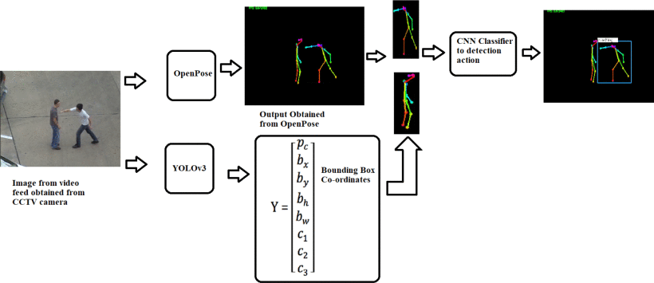

# Violence Detection using CNN-LSTM, YOLO, and OpenPose on Real-time CCTV Feed

## 1. Introduction

Welcome to the Violence Detection project using CNN-LSTM, YOLO, and OpenPose on Real-time CCTV Feed. This project is designed to address the critical need for public safety and security by detecting violent behavior or actions in real-time CCTV footage. By leveraging the power of advanced computer vision and deep learning techniques, this system can help identify potential threats and respond promptly to critical situations.

## 2. Project Overview

The Violence Detection system combines state-of-the-art technologies to achieve accurate and efficient detection of violent incidents:

- **Convolutional Neural Network (CNN)**: The CNN forms the backbone of the system and is responsible for object detection and classification in the CCTV footage. It can identify various objects, including people and other relevant items in the scene.

- **Long Short-Term Memory (LSTM)**: To analyze the temporal behavior of detected objects, the system employs LSTM networks. This enables the model to understand movement patterns and interactions between objects over time, essential for identifying potential violent actions.

- **YOLO (You Only Look Once)**: The YOLO algorithm is used to perform real-time object detection, significantly enhancing the system's ability to locate and track objects accurately, including individuals engaging in violent behavior.

- **OpenPose**: By utilizing the OpenPose library, the system extracts human body keypoints, such as joint positions and gestures. This feature enables the system to comprehend body language and recognize specific actions that might indicate violence.

## 3. Contributing

We welcome contributions to this project from the community. If you would like to contribute, please follow these steps:

1. Fork the repository.

2. Create a new branch for your feature/bugfix: `git checkout -b feature-name`.

3. Implement your changes and commit them: `git commit -m "Add feature/fix bug XYZ"`.

4. Push the changes to the branch: `git push origin feature-name`.

5. Submit a pull request outlining the details of your changes.

Please ensure that your code adheres to the project's coding conventions and includes appropriate test coverage.

## 4. Acknowledgements

We express our heartfelt gratitude to the developers and contributors of the following open-source projects that have been instrumental in the development of this violence detection system:

- [OpenPose](https://github.com/CMU-Perceptual-Computing-Lab/openpose)
- [YOLO](https://github.com/pjreddie/darknet)
- [TensorFlow](https://www.tensorflow.org)
- [Keras](https://keras.io)
- [NumPy](https://numpy.org)

Thank you for choosing our Violence Detection project! If you have any questions or feedback, please feel free to contact us at [project_email@example.com](mailto:project_email@example.com).
